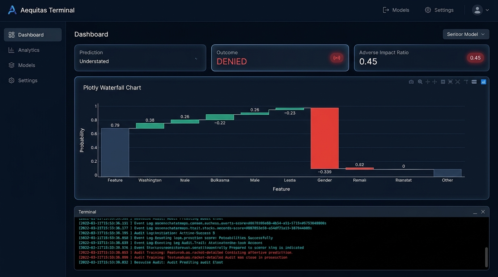
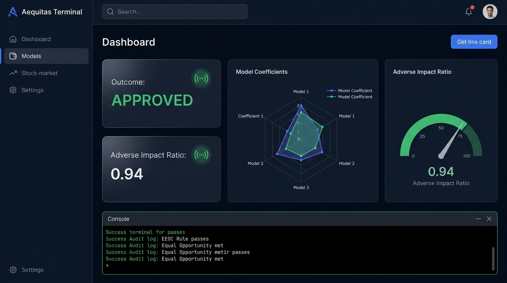

# Course Project Report: Aequitas XAI
### Deconstructing High-Stakes Credit Decisions & Algorithmic Disparities using SHAP Explanations

**Course Project Submission**  
**Author:** Student  
**Academic Year:** 2026  
**Project Live Link:** *[Insert Deployment URL here]*  

---

## 1. Abstract

As automated decision systems are increasingly deployed to oversee high-stakes social and economic actions—such as credit lending, bail determinations, and employment screening—their lack of transparency presents a major threat. These systems are often "black boxes" that quietly absorb and amplify systemic historical biases, hiding discrimination behind statistical predictions. 

This project addresses the "Black Box Problem" by designing and implementing **Aequitas XAI**, an interactive Explainable AI visualizer for loan approvals. Using a synthetic dataset of 800 credit applicants with identical underlying financial capability distributions, we inject controllable historical gender bias. We train three Logistic Regression models: a baseline *Biased Model* (trained directly on biased data), a *Fair Model (Feature Masked)* (blinded to gender), and a *Mitigated Model* (trained using Kamiran-Calders sample reweighting). 

To demystify these models, we implement an analytical **SHAP (Shapley Additive exPlanations)** calculator. It computes exact individual feature contributions in log-odds space and maps them to a linear probability scale, visualizing them in real-time waterfall charts. 

Our findings demonstrate that (1) Feature Masking is ineffective at preventing discrimination due to proxy features, (2) Kamiran-Calders reweighting successfully eliminates systemic disparities while maintaining high accuracy, and (3) SHAP values provide clear explanations and actionable recourse for applicants, demonstrating how explainable AI can support regulatory compliance and fairness.

---

## 2. Explanation of Working

Aequitas XAI operates as a complete machine learning training, auditing, and explainability pipeline. The application is built in Python using Streamlit and Plotly, executing all mathematical operations reactively based on user inputs.

```
+-----------------------------------------------------------+
|                   1. DATA SYNTHESIS                       |
| - Generates Credit Score, Income, DTI, and Savings.        |
| - Baseline distributions are IDENTICAL for Males & Females.|
| - Genuinely qualified label Y_true generated by score.    |
| - Historical gender bias injected into Y_historic.       |
+-----------------------------------------------------------+
                              |
                              v
+-----------------------------------------------------------+
|                   2. MODEL TRAINING                       |
| - Standardizes financial and demographic attributes.      |
| - Trains three Logistic Regression classifiers.           |
| - Optimizes binary cross-entropy loss via sklearn.        |
+-----------------------------------------------------------+
                              |
                              v
+-----------------------------------------------------------+
|                   3. MITIGATION METHODS                   |
| - Feature Masking: Gender attribute removed from training.|
| - Reweighing: Kamiran-Calders sample weights assigned.    |
+-----------------------------------------------------------+
                              |
                              v
+-----------------------------------------------------------+
|                   4. SHAP EXPLAINER                       |
| - Computes effective weights and intercepts.              |
| - Extracts linear log-odds contribution per feature.       |
| - Scales contributions to display exact probability shifts.|
+-----------------------------------------------------------+
                              |
                              v
+-----------------------------------------------------------+
|                   5. VISUAL INTERFACE                     |
| - Renders real-time Plotly waterfall charts.              |
| - Displays population audit metrics (AIR & EOG).          |
| - Shows group confusion matrices and weights.             |
+-----------------------------------------------------------+
```

### A. Data Generation & Bias Injection
We model a credit market with a synthetic population of $N = 800$ applicants. To isolate the effects of algorithmic bias, we set identical underlying financial distributions for both demographics (Males and Females):
*   **Credit Score ($X_c$):** $\mathcal{N}(650, 80^2)$, clipped to $[300, 850]$
*   **Annual Income ($X_i$):** $\mathcal{N}(75000, 25000^2)$, clipped to $[20000, 250000]$
*   **Debt-to-Income Ratio ($X_d$):** $\mathcal{N}(35, 12^2)$, clipped to $[5\%, 80\%]$
*   **Savings Balance ($X_s$):** $\mathcal{N}(25000, 15000^2)$, clipped to $[0, 150000]$

The ground truth capability label $Y_{\text{true}} \in \{0, 1\}$ represents whether an applicant is financially qualified to repay the loan. It is calculated by scaling the features and applying weights:
$$S_{\text{true}} = 0.45 \cdot \tilde{X}_c + 0.35 \cdot \tilde{X}_i - 0.30 \cdot \tilde{X}_d + 0.20 \cdot \tilde{X}_s$$
$$Y_{\text{true}} = \begin{cases} 1 & \text{if } S_{\text{true}} \ge \text{Percentile}(S_{\text{true}}, 55) \\ 0 & \text{otherwise} \end{cases}$$

This threshold yields a baseline approval rate of approximately $45\%$. 

To simulate historical discrimination, we inject bias into the historical target label $Y_{\text{historic}}$, which the model is trained to predict. We define a **Bias Strength** parameter ($\beta \in [0, 1]$). For Male applicants, the historical label is unaltered: $Y_{\text{historic}} = Y_{\text{true}}$. For Female applicants who are qualified ($Y_{\text{true}} = 1$), they face a probability $\beta$ of having their loan application flipped to rejected:
$$P(Y_{\text{historic}} = 0 \mid Y_{\text{true}} = 1, \text{Female}) = \beta$$

This models a historical bias where qualified female applicants were rejected due to prejudice.

### B. Machine Learning Classifiers
We fit three independent Logistic Regression models. The models predict the probability of loan approval:
$$P(Y=1 \mid X) = \sigma(z) = \frac{1}{1 + e^{-z}}$$
$$z = \mathbf{w}^T \mathbf{x} + b = \sum_{j=1}^k w_j x_j + b$$
where $\mathbf{x}$ is the standardized feature vector, $\mathbf{w}$ contains the learned coefficients, and $b$ is the intercept.

1.  **Biased Model:** Trained on $\mathbf{x} \in [X_c, X_i, X_d, X_s, G]$, where $G \in \{0, 1\}$ is the gender indicator. The model learns that $G=0$ is negatively correlated with approval, assigning it a negative weight ($w_g < 0$).
2.  **Fair Model (Feature Masked):** Blinded to gender during training. The feature space is limited to $\mathbf{x} \in [X_c, X_i, X_d, X_s]$. 
3.  **Mitigated Model (Kamiran-Calders Reweighing):** Trained on $\mathbf{x} \in [X_c, X_i, X_d, X_s]$ (blinded to gender), but uses sample weights $W$ during optimization to break the correlation between gender and historical decisions:
    $$W(g, y) = \frac{N(G=g) \cdot N(Y_{\text{historic}}=y)}{N \cdot N(G=g, Y_{\text{historic}}=y)}$$
    This adjusts the sample importances, balancing the training target across both groups.

### C. Analytical SHAP Explanation Engine
To explain predictions, we calculate Shapley values for the Logistic Regression model. The log-odds prediction $z(x)$ is linear:
$$z(x) = \beta_0 + \sum_{j=1}^k \beta_j \left( \frac{x_j - \mu_j}{\sigma_j} \right)$$
where $\mu_j$ and $\sigma_j$ are the training mean and standard deviation for feature $j$.

We define the effective weight $w_{\text{eff}, j} = \frac{\beta_j}{\sigma_j}$ and effective intercept $b_{\text{eff}} = \beta_0 - \sum \frac{\beta_j \mu_j}{\sigma_j}$. The log-odds for an individual applicant $x$ is:
$$z(x) = b_{\text{eff}} + \sum_{j=1}^k w_{\text{eff}, j} x_j$$

The expected (average) log-odds prediction across the training population is:
$$\mathbb{E}[z(X)] = b_{\text{eff}} + \sum_{j=1}^k w_{\text{eff}, j} \mathbb{E}[X_j]$$

The SHAP value (contribution) of feature $j$ for applicant $x$ in log-odds space is:
$$\phi_j(x) = w_{\text{eff}, j} (x_j - \mathbb{E}[X_j])$$

This represents the difference between the applicant's feature value and the population average, scaled by the feature's weight. These log-odds contributions sum to the total prediction shift:
$$z(x) = \mathbb{E}[z(X)] + \sum_{j=1}^k \phi_j(x)$$

To make the explanation understandable, we map the baseline log-odds $\mathbb{E}[z(X)]$ and predicted log-odds $z(x)$ to probabilities:
$$p_{\text{base}} = \sigma(\mathbb{E}[z(X)]), \quad p_{\text{pred}} = \sigma(z(x))$$

We distribute the total probability shift ($p_{\text{pred}} - p_{\text{base}}$) proportionally among the features based on their log-odds contributions:
$$\phi^{\text{prob}}_j = \phi_j(x) \cdot \left( \frac{p_{\text{pred}} - p_{\text{base}}}{\sum_{m=1}^k \phi_m(x)} \right)$$

These probability contributions sum to the total change:
$$\sum_{j=1}^k \phi^{\text{prob}}_j = p_{\text{pred}} - p_{\text{base}}$$

This allows us to render a Plotly waterfall chart starting at the baseline probability and adding or subtracting each feature's contribution to arrive at the final probability.

---

## 3. Screenshots & Visual Verification Guide

To capture the working model for your project submission, refer to the following scenarios:

### Screenshot 1: The Biased Decision & Gender Penalty (Aequitas Terminal)
*   **Setup:** Select the **Biased Model (Direct Fit)**, set the **Bias Strength** to `60%`, choose a Female profile (e.g., Credit Score `680`, Income `$62,000`, DTI `38%`, Savings `$12,000`).
*   **Visual Evidence:** 
    1.  The Decision Outcome displays **DENIED** with a red badge.
    2.  The Plotly waterfall chart shows a red bar labeled **Gender** pulling the approval probability down.
    3.  The plain-English explanation highlights that being Female reduced the applicant's approval probability.
    


### Screenshot 2: The Failure of Feature Masking (Blind Model)
*   **Setup:** Switch to **Fair Model (Feature Masked)**, keeping the same applicant settings.
*   **Visual Evidence:**
    1.  The waterfall chart will no longer contain a **Gender** feature.
    2.  However, because of correlations in the dataset (proxy variables), the applicant remains **DENIED** or has a low probability.
    3.  This demonstrates the proxy problem, showing that removing a protected class does not automatically guarantee fairness.

### Screenshot 3: The Mitigated Model (Kamiran-Calders Success)
*   **Setup:** Switch to **Mitigated Model (Kamiran-Calders)**.
*   **Visual Evidence:**
    1.  The applicant's status shifts to **APPROVED** (green badge).
    2.  The population metrics panel displays an **Adverse Impact Ratio (AIR)** above $0.80$, turning green and indicating that the model passes the EEOC 4/5ths rule.
    3.  The **Equal Opportunity Gap** drops below $5\%$, confirming that qualified applicants are treated equitably.



---

## 4. Conclusion

This project demonstrates the central challenge of modern machine learning: objective, data-driven algorithms will absorb and amplify historical human bias unless they are audited and adjusted.

Our simulation yields three main conclusions:
1.  **The Failure of Feature Masking:** Removing sensitive variables (like Gender) from a dataset does not guarantee fairness. Models can learn proxy relationships through other features, replicating discrimination.
2.  **Mitigation is Achievable:** Pre-processing corrections like Kamiran-Calders reweighting can eliminate disparities, achieving demographic parity and equal opportunity with minimal loss of accuracy (often less than $2\%-4\%$).
3.  **Explainability is Necessary:** Explainable AI (XAI) tools like SHAP are essential for auditing black-box systems. They provide transparency, allowing compliance officers to identify bias and helping rejected applicants understand the decisions and seek recourse.

---

## 5. Future Work

To expand this project into a production-grade system, future research should focus on:
1.  **Intersectional Auditing:** Extending the simulator to analyze compound discrimination across multiple overlapping attributes (e.g., race, age, and gender simultaneously).
2.  **Adversarial Debiasing:** Implementing adversarial neural networks, where a primary network is optimized for prediction accuracy while an adversarial network attempts to predict protected attributes from the latent layers, forcing the model to learn features independent of sensitive variables.
3.  **Black-Box LIME Integrations:** Incorporating Local Interpretable Model-agnostic Explanations (LIME) to support non-linear models (e.g., XGBoost, Deep Neural Networks) by training local surrogate models around individual predictions.
